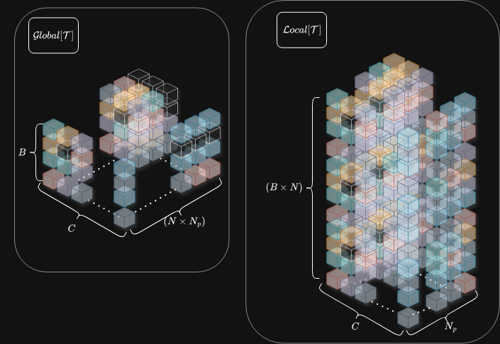

---
#### Tags: [[visual language models]], [[features extraction]], [[geometric processing]]
#### Source Link: https://arxiv.org/pdf/2601.19887
---
### Problem statement:
Основной проблемой своременных Neural Visual SLAM подходов служит дрейф внутренних  (intrinsics) и внешних (extrinsics) параметров фреймов при реконструировании карт 3D карты метсности по входным моноскопичесским последовательностям. Обусловолена данная проблема сложностью интерпретации динами темпоральных сдвигов входного масива изображений и отсутвием каких либо эталонных данных для сравнения результатов аппроксимации в момент инференса (если речь идет о моделях нацеленных на калибровку  + реконструукццию). 

---
### VGGT-SLAM pipline: 
ПАйплайн разработанные авторами можно разделить на две части, **perception data agregation** эксплуатирующий современные SOTA архитектуры для анализа входных данных и получению базисных результатов и **analog post-inference optimization**. Для начала я приведу описание всех используемых нейросетевых архитектур которые по сути берут на себя основную работу (а именно анализ входных данных), затем перейду к описанию пайплайна корриктеровки сгенерированных данных. 

### VGGT 
В основе всего пайплайна лежит темпоральный трансформер VGGT (Visual Geometry Grounded Transformer). Модель обладает уникальным механизмом обработки визуальных токенов последовательностей изображений, а так же ветвлением из 4 голов имеющих отдельную параметризацию и работающих с разными типами токенов.
![[Untitled Diagram-Page-2.drawio 1.svg]]

#### Alternating-Attention
Пусть $\mathcal{I} = \cup^{B}_{i = 1}\big[\mathcal{I}_{1}\big] \in \mathbb{R}^{B \times N \times 3 \times W \times H}$ входной батч последовательсностей изображений где  $\mathcal{I}_{i} = \cup^{N}_{i = 1}\big[I^{i}_1\big] \in \mathbb{R}^{N \times 3 \times W \times H}$.  В качестве backbone энкодера VGGT использует DINO v3 который в свою очередь является трансформерной надстройкой над ViT Patch энкодером. Мы же опустим различия между различными вариациями и модификациями ViT модели и будет обозначать энкодер как $\mathcal{A}_{\theta}\big[\mathcal{I}\big]: \mathcal{I} \rightarrow \cup^{B}_{i = 1}\big[\mathcal{T}_{I_1}\big] \in \mathbb{R}^{B \times N \times N_{p} \times d}$, где  $N_{p} = (\frac{W}{P} \times \frac{H}{P})$.

Сгенерированные визуальные токены последовательно пропускаются через TAB (Token Aggregation Block), формируя два типа компоновки: $\mathcal{Global}\big[\mathcal{T}\big]$ — токены глобальной семантической ориентированности и $\mathcal{Local}\big[\mathcal{T}\big]$ — токены локальной ориентированности. Смысл последовательного анализа заключается в изучении взаимосвязей между признаками, полученными при обработке разных компоновок. Модель сначала извлекает локальные признаки каждой подпоследовательности изображений, а затем взвешивает их глобальными признаками, извлечёнными по всему батчу. В результате модель плотно анализирует весь датасет, что позволяет ей оценить взаимосвязь между темпоральными сдвигами внутри подпоследовательности фреймов и глобальными изменениями от последовательности к последовательности. 

#### VGGT Prediction heads
Выход VGGT можно разбить на две категории: плотные карты (dense maps) и разряженные параметры локальных фреймов. Зя генерацию первыю отвечает DPT(Dense Prediction Transformer) использующие классические трансформерне блоки таки reampling для реализации downsample  fusion как в классических Unet, где контект извлекаемых признаков регрессиют по размерности из за чего модель сначала извлекает глоабальные признаками со всего изоражения затем переходит на мене объемные локальные области. Второй тип генерируемых данных данных использует learnable токены которые ыли "примешенны" к основным скрытым активациям как правило они не представляют осообй сложности в оработке и для них используются классические FCN блоки.

##### DPT(Dense Prediction Transformer)
Важнейшим пунктом VGGT является его возможность генерировать плотные карты глуины и облака точек и наилучшим образом на сегодняшний день с этой задачей справляется именно DPT. 

.png)
Сама модель состоит модель состоит из 4 последовательных трансформерынх блоков, мы же будем считать что используются аналог TAB. Каждый блок агрегирует последовательсность атквизуальных + learnable токенов. Затем каждый выход передается в Resable слой, состояющие из дву частей: Read + Concatenate модуль, который примешивает learnable токены с оубучаемыми токенами (смотри ниже) и реализующий конкатенацию обратынных Patch токенов в том же порядке в котором они формровались, и Resample модуль, который корректирует размерность выходных слоев и проецирует их hidden активации при помощи обычных Conv2d слоев. 
$$
\begin{cases}
Read(\mathcal{T} = \cup^{n + 1}_{k = 1}\tau_{k}) = \mathcal{T} \oplus \tau_{n+ 1};\\
Read(\mathcal{T}) = \mathcal{T} \oplus \mathcal{f}_{\theta}\big[\tau_{n + 1}\big];\\
n = (\frac{W}{P} \times \frac{H}{P})
\end{cases}
$$

Принцип раобты данной модели идентичен принципу работы Unet архиетктур с той лишь разницей что для экстракта признаков тут напрямую используются токены и Attention механизм что может быть полезно в multi modal cases (можно использовать Attention для фьюза токенов имеющих разную доменную ореинтированность).

##### Camera prediction head
Следующие важный этап такреконструкции сцены заключается в обработке всех learnable токенов которые модель обогощала на этапе агрегации токенов (AA). 

##### Обучение VGGT
**Фунция потерь** на которой обучается модель, состоит из 4 компонент, каждому выходу по своему члену:
$$
\mathcal{L} = \mathcal{L_{cam} + L_{pmap} + L_{depth} + \lambda L_{track}}
$$
1) $\mathcal{L_{cam}} = \sum_{i = 1}^{N}\|g^{'}_{i} - g_i\|_{\epsilon}$ - расстояние Хюбера, используются для оптимизации поз камеры. сдесь $g^{'}, g$. Так как параметры фремов (ints/exts) одна из наиболее чувстительных к резким изменениям областей оптимизации VGGT авторы скорее всего и решили использовать данную функцию как компромис между эффективной MSE и крайене стабильной MAE.
2) $\mathcal{L_pmap} = \mathcal{L_{global} + L_{local}} = \sum^{N}_{i = i} \big[\|\Sigma^{P}_{i} \odot (\hat{P}_{i} - P_{i})\| + \|\Sigma^{P}_{i} \odot(\nabla\hat{P}_{i} - \nabla P_{i})\|\big] - \alpha \ln{\Sigma^{P}_{i}}$ - функция для сравнивания dense выводов (конерктно тут приведен пример для карты xyz точек), состояющая из двух компонент. Первая член $\mathcal{L_{global}}$ отвечает за сравнение глобального контекста, т.е сравнивает расстояния между всеми координатами (u, v) грида для имеющихся карт, второй $\mathcal{L_{local}}$ отвечает за локальное сравнивание соседних пикселей. Если с первым все понятно, то второй член нуждается в пояснении. Очень важным фактором при генерации плотных карт на подобии (rgb, depth, xyz) является гладкость самой карты, для того чтобы просчитатать расхождение сгенерированного варианта с таргетным обе карты взвешиваются фильтрами собеля для оброзования общего градиента карты, после чего сравнениие производится уже глобально по получившимся картам градиентов. Очень важным элементом данной функции является контроль функции потерсь через ***гомоскедастичность***. Вместе с картами модель так же генерирует $\Sigma^{P}_{i}$ маску уверенности (conf. map) являющейся по сути картой распределения дисперсии значений (u, v) точек. Там где расстояния между точками карт маленькой модель отнивает от значения функции потерь пролагорифмированные значения дисперсии, там где значения велики те же значения используется для выделения наиболее оптимальных точек чтобы не учитывать черезмерные расхождения и не забивать ими градиенты
3) наконец $\mathcal{L}_{track} = \sum^{M}_{j = 1}\sum^{N}_{i = 1} \|\hat{y}_{ji} - y_{ji}\|_{2}$  - используется просто для просчета расстояния по всем обнореженным точкам. В качестве дополнительного модуля для трекинга фичей меджу фреймами авторы использовать CoTracker (но на мой взгляд разумнее было бы использовать что то на подобии Loftr, потому что тогда появилась бы возможность сравнивать intermediate активации LofTr с активациями из VGGT) 

### NetVLAD как основа DINO-SALAD:
Важным вопросом в мире 3D Vision и в частности Visual SLAM является вопрос о retrieval-анализе фреймов для реализации процедур loop closure, выравнивающих фреймы, имеющие один и тот же семантический смысл. Семантика в данном случае представлена в виде векторов дескрипторов, являющихся уникальными метками для каждого фрейма в последовательности. NetVLAD — один из наиболее распространённых и популярных подходов в области извлечения унифицированных векторных представлений, объединяющий в себе современные нейросетевые подходы и классический VLAD-пайплайн.

Пусть дан набор изображений $\mathcal{I} = \big \{I_1, ..., I_N \mid I_i \in \mathbb{R}^{W\times H\times 3}\big \}$. NetVLAD стремится сформировать оператор $f_{\theta}(I_i): I_i \rightarrow \mathbb{R}^{d}$, после чего можно будет пропустить набор изображений через данный оператор и сравнивать расстояния $d_{\theta}(I_i, I_j) = \| f_{\theta}(I_i) - f_{\theta}(I_j) \|$ между ними для поиска наиболее схожих по семантической принадлежности (т.е. по значениям генерируемых векторов).

**Классический VLAD**
Сначала извлекаются первичные кластеры признаков (для этого обычно используются классические BoF-методы). Обозначим эту операцию в виде оператора
$$
\mathcal{B}\big[I_i\big]: I_i \rightarrow \{\vec{c}_1, ..., \vec{c}_K \mid \vec{c}_i \in \mathbb{R}^{d}\}
$$
Далее формируется набор локальных дескрипторов. Обозначим функцию, отвечающую за их формирование, также в виде произвольного параметризованного оператора:
$$
\mathcal{\chi}\big[I_i\big] \rightarrow \{\vec{x}_1, ..., \vec{x}_N \mid \vec{x}_i \in \mathbb{R}^{d}\}
$$
Далее формируется взвешенная матрица $V \in \mathbb{R}^{N \times K}$, описывающая степень близости локальных дескрипторов изображения с извлечёнными центроидами:
$$
\begin{array}{c}
V(j, k) = \sum_{i = 1}^{N} a_k(\vec{x}_i)\big[\vec{x}_i(j) - \vec{c}_k(j)\big] \\[5pt]
a_k(\vec{x}_i) = \begin{cases}
1, & \text{если } d(\vec{x}_i, \vec{c}_k) < \tau \\
0, & \text{если } d(\vec{x}_i, \vec{c}_k) > \tau
\end{cases}
\end{array}
$$
Окончательно матрица $V$ преобразуется в вектор вида $\vec{V} \in \mathbb{R}^{N \cdot K}$.

**Параметризация VLAD — NetVLAD подход**
NetVLAD отличается от оригинального алгоритма в двух местах:
1) **Параметризация оператора извлечения локальных дескрипторов** $\chi \rightarrow \chi_{\theta} \big[I_i\big]$ с помощью CNN-модели. Теперь оператор работает следующим образом:
   $$
   \chi_{\theta}\big[I_i\big]: I_i \rightarrow G \in \mathbb{R}^{W \times H \times d}
   $$
   формируя множество (обучаемых локальных репрезентаций — дескрипторов) $\big \{\vec{\mathcal{x}}_{\theta; 1}, ..., \vec{\mathcal{x}}_{\theta; N} \mid N = W \times H \big \}$.
2) **Замена функции взвешивания** параметризованной, гладкой, дифференцируемой функцией: $a_k(\vec{x}_i) \rightarrow a_{\theta; k}(\vec{x}_i)$. Основная проблема оригинальной функции взвешивания заключалась в том, что она имела дискретную структуру, что ставило крест на возможности оптимизации параметров модели. Авторы переработали её и представили в виде softmax-функции от расстояния локальных дескрипторов до их центроид:
   $$
   a_{\theta, k}(\vec{x}_{\theta; i}) = \frac{e^{-\alpha\|\vec{x}_{\theta; i} - \vec{c}_k\|}}{\sum_{k'}e^{-\alpha\|\vec{x}_{\theta; i} - \vec{c}_{k'}\|}} = \frac{e^{\vec{\omega}_{k}^{T}\vec{x}_{\theta;i} - b_k}}{\sum_{k'}e^{\vec{\omega}_{k'}^{T}\vec{x}_{\theta; i} - b_{k'}}}
   $$
   где $\vec{\omega}_k = 2\alpha \vec{c}_k$, $b_k = -\alpha \|\vec{c}_{k}\|$.
3) **Параметризация вспомогательных аргументов** $(\vec{\omega}_{k}, b_{k}) \rightarrow (\vec{\omega}_{\theta; k}, b_{\theta; k})$, которая проводится на основе извлечённых дескрипторов $G$. Параметризация представлена в виде CNN-слоя с ядрами $\vec{\omega}_{\theta, k}$ размерностью $(1 \times 1 \times d)$ и смещениями $b_{\theta; k}$.

### Graph optimizaiton & loop closure
Авторы работы в попытках оптимизировать результаты инференса классического VGGT, разработали двуступенчатую процедуру оптимизации основанную на оптимизации сгенерированнго графа поз. Сруктура итогового графа поз имеет вид (рис 5): 
	1) Каждый сабграф состоит из такопределонного кол-ва фреймов имеющих меджу собой не еденичную матрицу преоброзования (ориентация + смещение) $H^{i}_{j} = T^{-1}_{i}T_{j}$. 
	2) Между сабграфами распологаются фремы имеющие бликие feature simillatiry скор (полученные в результате image retrieval анализа). Фреймы которые считаются идентичными принадлежат разным сабграфам при этом один из них является началом одной сабкарты и соотвественно второй концом другой. Авторы специально считает ориентацию и положение этих фреймов инедтичными и матрицу преброзование между ними формирует как $H^{i}_{j} = \begin{bmatrix}K^{-1}_{i}K_{j} & 0 \\ 0^{T} & s\end{bmatrix}$. 
Оптимизирование матриц преоброзование между фреймами сабграфов позволяют соглосовать позы между всеми фреймами карты корректируя ее геометричесские особенности. С другой стороны оптимизация афинной матрицы координат между двумя идентичными фреймами приводит к метрической соглосованности карты, что делают ее боле применимой в условиях реальной физичесской симмуляции.

---

